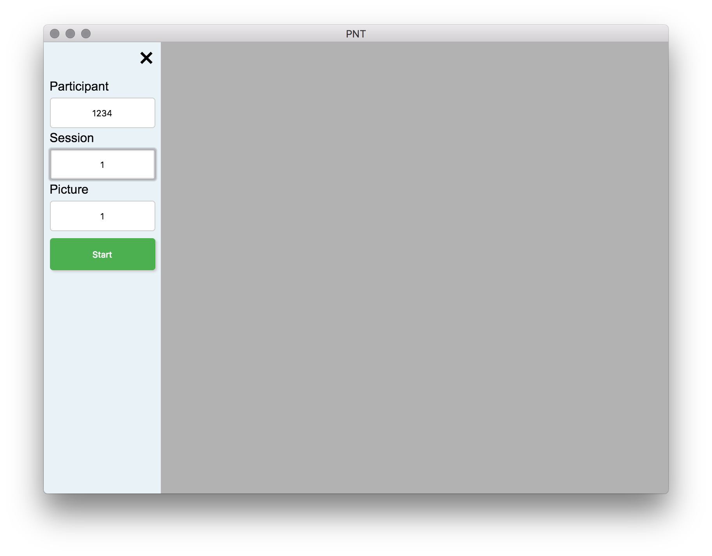
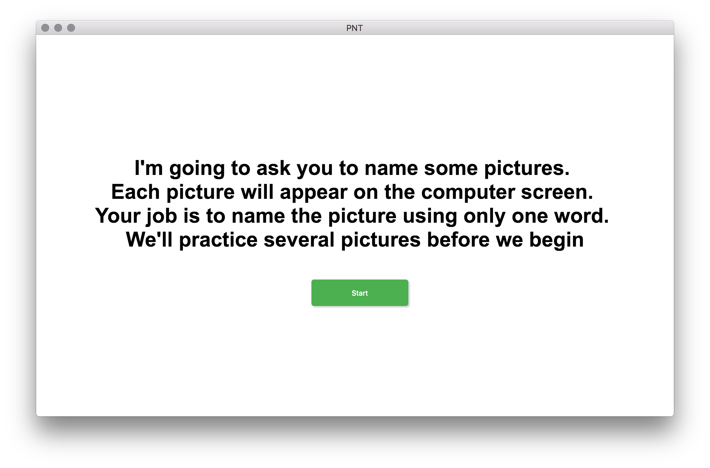
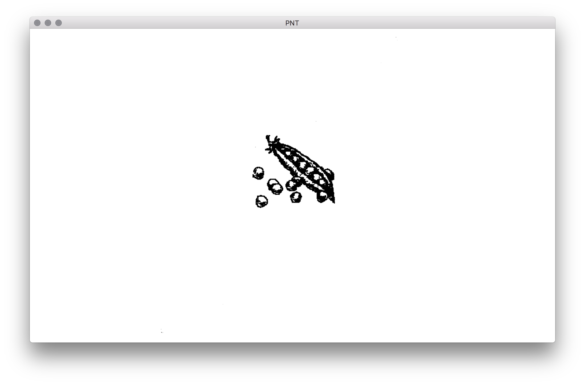
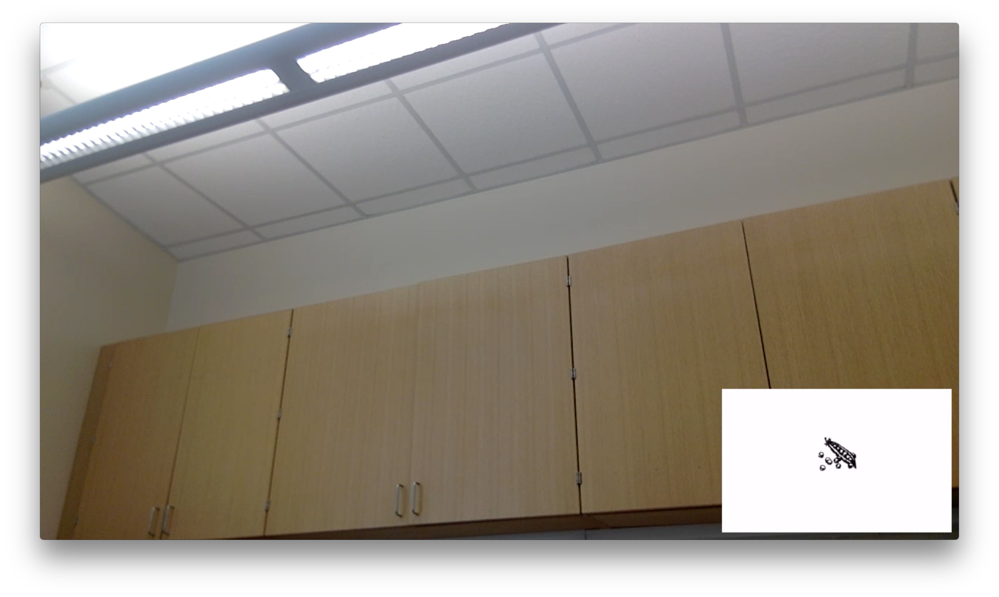

# PNT

(Philadelphia Naming Test)

##### Dowload the [latest version](https://github.com/hanayik/Philadelphia-Naming-Test/releases/latest)

### Description
The PNT is a 175-item picture naming test developed in the Language and Aphasia Lab of MRRI for the psycholinguistic exploration of lexical access in nonaphasic and aphasic speakers (Roach et al., 1996).

This is a full service app. For clinical reference, please see [the Moss Rehab Research Institute web site](http://mrri.org/philadelphia-naming-test/). This program was made for use at the [Center for the Study of Aphasia Recovery](http://cstar.sc.edu/)

Features:

- Automatic video recording from MacBook camera
 
- Automatic screen recording

- Video and screen recording saved using a picture-in-picture effect (screen recording is placed in bottom right corner of video recording)

- Automatic audio recording with video and screen

- Auto timeout function for pictures set to 30 seconds

- Continuous video saving (doesn't wait until the end to save everything). The program saves as it goes

- Pause the program by pressing the "Escape" or "q" keys on the computer keyboard

The saved video location will depend on your computer. The program automatically detects if you have Dropbox, or Box folders on your computer and tries to save to those locations first, in that order. If you do not wish to save to the cloud folders then uncheck that option in the menu bar. If the cloud saving option is unchecked, or those folders do not exist on your computer then the app will save to it's default MacOS location which is ``` ~/Library/Application Support/PNT/data ```


  

### Screenshots









### Credits
[Icon](http://www.flaticon.com/authors/madebyoliver)

[ffmpeg](https://www.ffmpeg.org/)

### License
[MIT](https://github.com/hanayik/Philadelphia-Naming-Test/blob/master/LICENSE)

This app was made specifically for the CSTAR group, but is open source so that others may modify and use as desired.

### Developers
This app is currently only developed for MacOS, and a compiled version of ffmpeg is bundled with the app. 

##### To clone repo:

``` cd /to/your/desired/install/location ```

``` git clone https://github.com/hanayik/Philadelphia-Naming-Test.git ```

##### To install packages:

``` cd Philadelphia-Naming-Test ```

``` npm install ```

##### To run

``` npm start ```


### Links
[CSTAR](https://cstar.sc.edu/)

[Aphasia Lab](https://web.asph.sc.edu/aphasia/)


